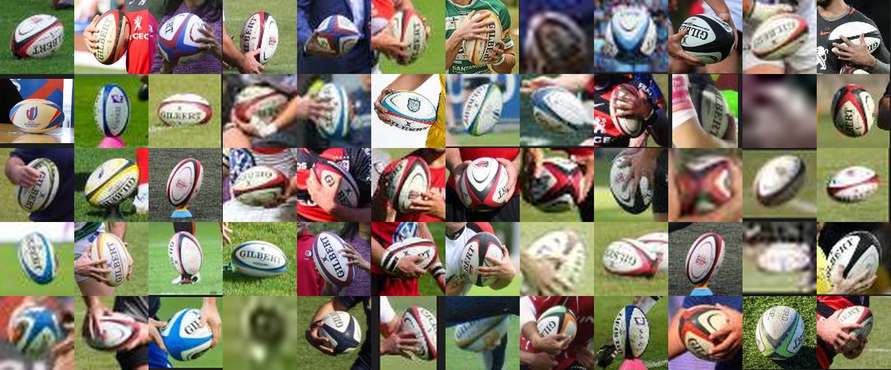

# Rugby Ball Detector



⚠️ **Experimental.** This is a quick proof of concept, not a polished or maintained tool -
detection quality is limited by a small (178-image) training set, and the code hasn't had
much hardening. Expect rough edges. The training images are mostly professional rugby
photos, which almost exclusively feature **Gilbert** balls (the official supplier for World
Rugby, Six Nations, etc.) - don't expect this to generalise well to other ball brands.

A YOLOv8-trained object detector for spotting rugby balls in photos and videos, running
entirely in the browser via ONNX Runtime Web - no server, no upload.

**Live demo: https://davidchatting-bot.github.io/rugby-ball-detector/**

Drop an image or video onto the page and it'll run the model client-side and draw a box
around any rugby ball it finds.

## Contents

- `index.html` - the browser demo (loads `best.onnx` and runs inference with `onnxruntime-web`)
- `best.onnx` / `best.pt` - the trained model weights (ONNX and PyTorch formats)
- [`training.txt`](training.txt) - Wikimedia Commons URL for every training image, one per line;
  each page lists that image's specific Creative Commons license and author
- [`labels/`](labels/) - where the ball is in every training image, in YOLO format; one `.txt`
  file per image, named after its Commons file title (decode the URL in `training.txt` to
  match a label to its source), plus `classes.txt` (`rugby_ball` = class `0`)

The training images themselves aren't included in this repo (see `.gitignore`) - it's a
local-only YOLOv8 export from Roboflow, 178 images, one class (`rugby_ball`), fully covered
by `training.txt` and `labels/`.

## Using the labels

Each line in a `labels/*.txt` file is one annotated ball, `class` followed by normalized
(0-1) coordinates - but the coordinate format isn't consistent across the dataset, because
Roboflow preserved however each ball was originally annotated:

- **83 lines** are a plain box: `class x_center y_center width height`
- **125 lines** (in 97 of the 178 files) are a polygon outline instead: `class x1 y1 x2 y2 ...`
  (an even number of coordinates, one vertex per pair, tracing the ball's outline rather than
  a box around it)

Ultralytics' own training pipeline (used to produce `best.pt` / `best.onnx`) handles both
automatically, converting a polygon to its enclosing box when training a detector. If you're
parsing these by hand, branch on the number of fields per line:

```python
fields = line.split()
cls, coords = fields[0], [float(v) for v in fields[1:]]

if len(coords) == 4:
    xc, yc, w, h = coords          # already a box
else:
    xs, ys = coords[0::2], coords[1::2]
    xc = (min(xs) + max(xs)) / 2    # derive the enclosing box
    yc = (min(ys) + max(ys)) / 2    # from the polygon's extent
    w, h = max(xs) - min(xs), max(ys) - min(ys)

x1, y1 = (xc - w / 2) * image_width, (yc - h / 2) * image_height
x2, y2 = (xc + w / 2) * image_width, (yc + h / 2) * image_height
```

Multiply by the image's actual pixel width/height to get a drawable box - or, for the
polygon lines, draw `coords` directly as a filled/outlined polygon (grouped into `(x, y)`
pairs the same way) for a tighter outline than the enclosing box gives you.
