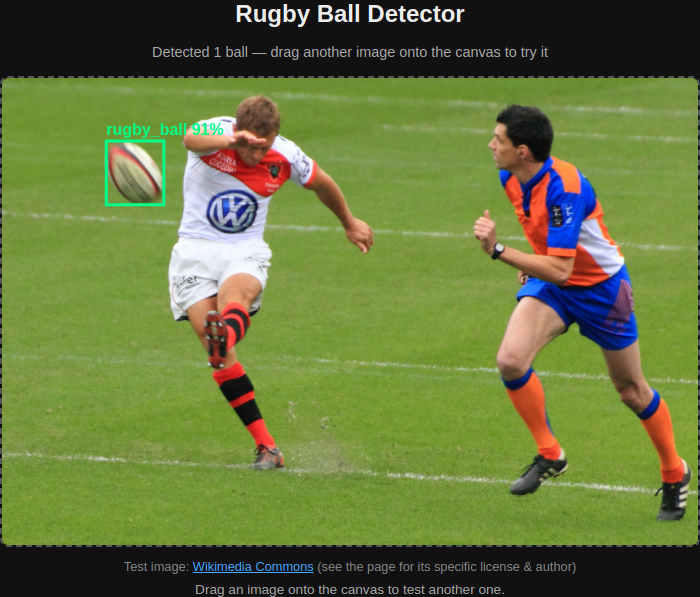

# Rugby Ball Detector

<!-- screenshot.png is regenerated from the live demo by .github/workflows/build.yml on every
     push to master - don't hand-edit it, it'll just get overwritten. -->

[Try the p5.js demo](https://davidchatting-bot.github.io/rugby-ball-detector/) with an image or video.

A small YOLOv8 model for detecting rugby balls in photos and video, running entirely in the
browser (no server, no upload) via ONNX Runtime Web and p5.js. It is trained on a small set of images, so not at production quality. The training photos are exclusivelky of **Gilbert** balls, and this may not gneeralise well to other brands.

## Contents

- `index.html` / `style.css` / `sketch.js` - the browser demo (p5.js UI, `rugby-ball-detector.onnx`
  run with `onnxruntime-web`)
- `rugby-ball-detector.onnx` / `rugby-ball-detector.pt` - the trained model weights (ONNX and
  PyTorch formats)
- `screenshot.png` - a screenshot of the live demo, regenerated on every push by
  [`.github/workflows/build.yml`](.github/workflows/build.yml) (headless Chromium via
  Playwright, see [`screenshot.js`](.github/workflows/screenshot.js))
- [`dataset/`](dataset/) - the training data: every image's Wikimedia Commons URL and ball
  location(s) as `dataset.json`, plus `export_yolo.py` to turn that into a YOLO-ready
  directory. See [`dataset/README.md`](dataset/README.md) for the JSON schema and how to
  rebuild a full training set from it.

The training images themselves aren't included in this repo (see `.gitignore`) - it's a
local-only YOLOv8 export from Roboflow, 178 images (117 train, 41 valid, 20 test), one class
(`rugby_ball`), fully covered by `dataset/dataset.json`.
